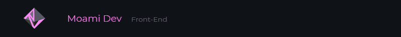

<!--
### Hi there 👋
**MoamiStay/MoamiStay** is a ✨ _special_ ✨ repository because its `README.md` (this file) appears on your GitHub profile.

Here are some ideas to get you started:

- 🔭 I’m currently working on ...
- 🌱 I’m currently learning ...
- 👯 I’m looking to collaborate on ...
- 🤔 I’m looking for help with ...
- 💬 Ask me about ...
- 📫 How to reach me: ...
- 😄 Pronouns: ...
- ⚡ Fun fact: ...

https://www.pngfind.com/mpng/iRJJTwT_binary-png-binary-black-and-white-background-transparent/
-->

<!--  -->  
  
### Hi, I am Moami Stay 👋 
Certified introvert, night-owl, travel-enthusiast and fulltime dog mom ✨

--- 

I got a Front-End degree from Noroff Vocational School in Bergen.  

I prefer doing design-work and really enjoy working with programs such as Figma and Photoshop and being creative.  
After I finish my degree I will be on the lookout for a job preferably as a Web-Designer or something close to that field 😄  
 

- ⚡ Fun fact: When I was 13 years old I took part in creating a artwork that the queen personally said she wanted to keep. So now the artwork is displalyed somewhere in the castle (I suppose anyway). The name of the piece was "Dronningen og Nerdrum titter på kunst".  
