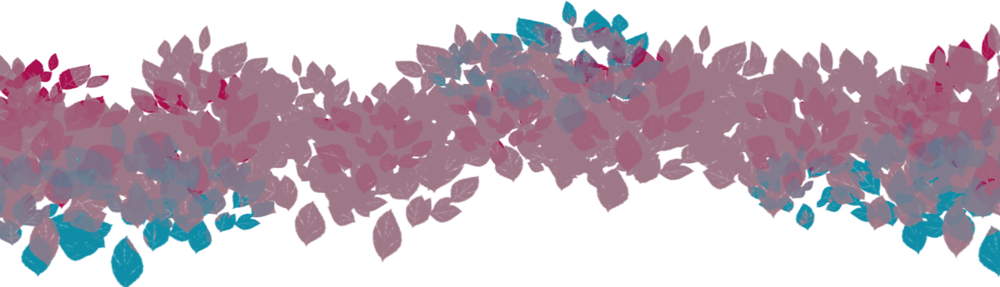

<!--
### Hi there 👋
**MoamiStay/MoamiStay** is a ✨ _special_ ✨ repository because its `README.md` (this file) appears on your GitHub profile.

Here are some ideas to get you started:

- 🔭 I’m currently working on ...
- 🌱 I’m currently learning ...
- 👯 I’m looking to collaborate on ...
- 🤔 I’m looking for help with ...
- 💬 Ask me about ...
- 📫 How to reach me: ...
- 😄 Pronouns: ...
- ⚡ Fun fact: ...
-->

  

### Hi there! I am Moami Stay ✨

i am currently a student at Noroff in Bergen studying Front-End development.
What I enjoy working on the most is the design aspect of Front-End. I fin dusing programs such as Figma and Photoshop fun.

I am just testing out stuff right now... trying to clean up my github account, it's quite messy in here.. hehe

This readme file is definitively not gonna stay like this. 
